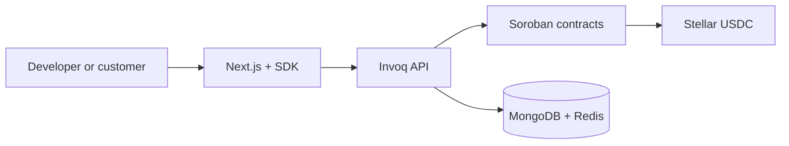

# Invoq

### Programmable subscription billing and usage infrastructure for Stellar

[](https://stellar.org/)
[](https://developers.stellar.org/docs/build/smart-contracts)
[](https://nextjs.org/)
[](https://www.typescriptlang.org/)

Invoq gives developers one stack for recurring Stellar USDC payments, subscription state, feature entitlements, usage metering, prepaid vaults, spending policies, webhooks, and billing operations. It combines four Soroban contracts with an Express API, a TypeScript SDK, and a Next.js control plane.

> [!IMPORTANT]
> Current deployments target **Stellar Testnet**. Contracts have not been presented as independently audited for Mainnet use. Testnet USDC has no monetary value.

## Links

| Resource | Link |
|---|---|
| Live application | [invoq.rajivdubey.dev](https://invoq.rajivdubey.dev) |
| Product presentation / pitch deck | [View presentation](https://invoq-product-presentation.tiiny.site/) |
| Product walkthrough | [Watch on Google Drive](https://drive.google.com/file/d/1DbE18YM2nTtJ-pW2BgrkW0e25yTwzFUV/view?usp=sharing) |
| Public Google Form | [https://forms.gle/EsKeNmXVTgGmyrT7A](https://forms.gle/EsKeNmXVTgGmyrT7A) |
| Public response spreadsheet | [Google Sheets export](https://docs.google.com/spreadsheets/d/1OIW30zV1ibOP594Ko6Mfr-zoEjeFOWWaQ8K4W9STDK0/edit?usp=sharing) |
| Source repository | [github.com/RAJIV81205/Invoq](https://github.com/RAJIV81205/Invoq) |
| Practical setup guide | [HOW_TO_USE.md](./HOW_TO_USE.md) |
| Project documentation | [Invoq_Project_Documentation.md](./Invoq_Project_Documentation.md) |
| Contract specification | [Invoq_Contract_Specification.md](./Invoq_Contract_Specification.md) |
| SDK reference | [packages/invoq-sdk/README.md](./packages/invoq-sdk/README.md) |
| Dashboard reference | [app/dashboard/README.md](./app/dashboard/README.md) |

## Repository files

The following files are present in this repository and are intentionally linked here for quick navigation:

- `README.md` - this main project overview.
- `HOW_TO_USE.md` - practical setup and usage guide.
- `Invoq_Project_Documentation.md` - project proposal and architecture write-up.
- `Invoq_Contract_Specification.md` - detailed Soroban contract specification.
- `packages/invoq-sdk/README.md` - SDK reference and usage notes.
- `app/dashboard/README.md` - dashboard architecture and route reference.
- `invoq-api/FIRST_TIME_SETUP.md` - backend first-time setup instructions.
- `Dockerfile` - production container definition for deployment/CD demos.
- `.github/workflows/ci.yml` - CI workflow for checks and build validation.
- `compose.yml` - local MongoDB and Redis support services.

## Demo video

> [Watch the complete Invoq product walkthrough →](https://drive.google.com/file/d/1DbE18YM2nTtJ-pW2BgrkW0e25yTwzFUV/view?usp=sharing)

## Screenshots

<table>
  <tr>
    <td align="center" width="50%"><strong>Screenshot 1</strong><br /><sub>Product landing page</sub><br /><br /><em>
</em></td>
    <td align="center" width="50%"><strong>Screenshot 2</strong><br /><sub>Developer dashboard</sub><br /><br /><em>
</em></td>
  </tr>
  <tr>
    <td align="center" width="50%"><strong>Screenshot 3</strong><br /><sub>Plan and API key setup</sub><br /><br /><em>
</em></td>
    <td align="center" width="50%"><strong>Screenshot 4</strong><br /><sub>Customer checkout</sub><br /><br /><em>
</em></td>
  </tr>
  <tr>
    <td align="center" width="50%"><strong>Screenshot 5</strong><br /><sub>CI</sub><br /><br /><em>

</em></td>
  
  </tr>
</table>

## What Invoq does

- Creates flat-rate or metered plans on-chain.
- Collects recurring Stellar USDC payments without holding developer revenue.
- Stores subscription lifecycle and usage state in Soroban.
- Answers low-latency feature-entitlement checks through Redis-backed API routes.
- Buffers usage and flushes counters on-chain.
- Supports trials, cancellation, grace periods, payment retries, and renewal jobs.
- Provides prepaid customer/developer vaults for usage-based products.
- Enforces agent daily limits, transaction limits, and destination allowlists.
- Emits signed webhooks for billing and vault events.
- Gives developers a dashboard for plans, customers, usage, keys, webhooks, and vaults.

## How it fits together



The developer creates a plan. A customer connects Freighter and signs two transactions: USDC allowance approval, then subscription creation. `BillingCycle` transfers the first payment directly to the plan owner and asks `SubscriptionRegistry` to store the subscription. The API mirrors confirmed state into MongoDB so the customer and recurring-revenue estimate appear in the dashboard.

## Payment model

```text
Customer wallet ── Stellar USDC ──> Developer plan-owner wallet
                         │
                         └── Subscription state recorded on Soroban
```

Invoq does not custody flat-rate subscription revenue. The developer already owns received USDC; there is no Invoq withdrawal step. Prepaid usage billing is different: funds deposited into `EscrowVault` remain in the contract until debited or refunded.

Amounts use seven decimal places:

```text
1 USDC = 10,000,000 stroops
```

## Components

| Component | Responsibility | Technology |
|---|---|---|
| Dashboard and storefront | Onboarding, plans, customers, analytics, checkout demo | Next.js 16, React 19, Tailwind CSS 4 |
| REST API | Auth, orchestration, transaction building, fee sponsorship | Express 5, TypeScript |
| SDK | Browser checkout and server resources | TypeScript |
| Persistent database | Developers, API keys, cached subscriptions, webhook delivery | MongoDB 7 |
| Cache and queues | Entitlements, plan snapshots, usage buffers, jobs | Redis 7, BullMQ |
| Contracts | Billing, state, policy, escrow | Rust, Soroban SDK 25 |
| Settlement | USDC transfers and transaction finality | Stellar / SAC |

## Smart contracts

All addresses below are current Testnet deployments from `.env.example`.

| Contract | Address | Role |
|---|---|---|
| `SubscriptionRegistry` | [`CC5F...U3PF`](https://stellar.expert/explorer/testnet/contract/CC5FVK42PNUGPQZRYDYW7EVRIQIW2GTNPF6TVMZBBVPCLLDMJZLKU3PF) | Plans, subscriptions, entitlements, usage |
| `BillingCycle` | [`CAR6...UUOR`](https://stellar.expert/explorer/testnet/contract/CAR6HPIXMNI4B4GONOWCXLN2N7VHH45FEX7IM2JDARR7XZHETNVDUUOR) | Initial payment, renewals, retries, grace periods |
| `SpendPolicy` | [`CDTL...HFPG`](https://stellar.expert/explorer/testnet/contract/CDTLW43XT55X5FZB3PPC5Y7UG6PSYC4LW3ZED23YIEIVDXVOT72QHFPG) | Agent budgets and destination controls |
| `EscrowVault` | [`CBAN...2LLO`](https://stellar.expert/explorer/testnet/contract/CBANJOGMJZ3CAIHX45UWUTDUVXZIMUYOZPXNHYZLKKHZBQ5ZAR6L2LLO) | Prepaid balances, debits, refunds |
| Testnet USDC SAC | [`CBIE...DAMA`](https://stellar.expert/explorer/testnet/contract/CBIELTK6YBZJU5UP2WWQEUCYKLPU6AUNZ2BQ4WWFEIE3USCIHMXQDAMA) | Stellar asset contract used for settlement |

### 1. SubscriptionRegistry

Canonical on-chain source for plan configuration, customer subscription status, feature access, periods, and usage counters. `BillingCycle` is configured as its operator.

| Function | Access | Purpose |
|---|---|---|
| `initialize(admin, usdc_sac)` | Once | Configure admin and USDC SAC |
| `transfer_admin(new_admin)` | Admin | Transfer contract administration |
| `set_operator(operator)` | Admin | Authorize BillingCycle or another writer |
| `revoke_operator()` | Admin | Remove current operator |
| `get_admin()` | Read | Return admin |
| `get_operator()` | Read | Return configured operator |
| `create_plan(owner, name, price, interval, trial, limit, features)` | Owner-signed | Create developer-owned plan |
| `create_plan_for(caller, owner, ...)` | Admin/operator | Create plan for a developer |
| `update_plan(caller, plan_id, ...)` | Owner/admin/operator | Update mutable plan fields |
| `deactivate_plan(caller, plan_id)` | Owner/admin/operator | Block new subscriptions |
| `reactivate_plan(caller, plan_id)` | Owner/admin/operator | Reopen plan |
| `get_plan(plan_id)` | Read | Return plan configuration |
| `plan_count()` | Read | Return total plan count |
| `create_subscription(caller, customer, plan_id)` | Admin/operator | Store confirmed subscription |
| `update_status(caller, customer, status)` | Admin/operator | Change lifecycle status |
| `renew_subscription(caller, customer, start, end)` | Admin/operator | Advance period and reset usage |
| `cancel_subscription(caller, customer, immediate)` | Customer/admin/operator | Cancel now or at period end |
| `get_subscription(customer)` | Read | Return subscription record |
| `check_entitlement(customer, feature)` | Read | Return feature-access boolean |
| `check_entitlement_full(customer, feature)` | Read | Return access plus plan and usage context |
| `is_subscribed(customer)` | Read | Return non-terminal subscription state |
| `increment_usage(caller, customer, units)` | Admin/operator | Add usage units |
| `increment_usage_batch(caller, entries)` | Admin/operator | Add usage for a batch |

Subscription states:

```text
Trialing → Active → GracePeriod → Active
             │           │
             ├→ Paused   └→ Expired
             └→ Cancelled
```

### 2. BillingCycle

Customer-facing payment entry point and admin-driven renewal engine. Paid subscriptions require a Stellar USDC SAC allowance for this contract. The client SDK builds and submits approval before subscription creation.

| Function | Access | Purpose |
|---|---|---|
| `initialize(admin, registry_id, usdc_sac, grace_seconds)` | Once | Configure dependencies and grace period |
| `transfer_admin(new_admin)` | Admin | Transfer administration |
| `get_admin()` | Read | Return admin |
| `get_grace_period()` | Read | Return grace duration |
| `initiate_subscription(customer, plan_id)` | Customer-signed | Charge first payment and create subscription |
| `process_renewals(customers)` | Admin | Process due subscriptions in a batch |
| `expire_grace_periods(customers)` | Admin | Expire unpaid grace-period subscriptions |
| `retry_payment(customer)` | Admin | Retry one failed renewal |
| `retry_failed_payment(customer)` | Admin | Compatibility alias for retry |
| `set_grace_period(seconds)` | Admin | Set grace duration |
| `update_grace_period(seconds)` | Admin | Compatibility alias for grace update |
| `get_grace_record(customer)` | Read | Return failed-payment context |
| `get_registry_id()` | Read | Return registry address |
| `get_usdc_sac()` | Read | Return USDC SAC address |

### 3. SpendPolicy

Standalone policy layer for wallets or automated agents. A policy can limit daily spend, per-transaction spend, allowed destinations, and governed agent addresses.

| Function | Access | Purpose |
|---|---|---|
| `initialize(admin)` | Once | Configure admin |
| `transfer_admin(caller, new_admin)` | Admin | Transfer administration |
| `get_admin()` | Read | Return admin |
| `create_policy(owner, daily_limit, tx_limit, allowlist, agents)` | Owner-signed | Create policy |
| `update_policy(caller, daily_limit, tx_limit, allowlist, agents)` | Owner/admin | Replace policy fields |
| `deactivate_policy(caller)` | Owner/admin | Disable enforcement |
| `reactivate_policy(caller)` | Owner/admin | Restore enforcement |
| `check_spend(agent, destination, amount, timestamp)` | Read | Return detailed decision |
| `is_spend_allowed(agent, destination, amount, timestamp)` | Read | Return decision boolean |
| `record_spend(caller, agent, amount)` | Owner/admin | Add daily spend |
| `get_policy(owner)` | Read | Return policy |
| `get_agent_owner(agent)` | Read | Resolve agent to owner |
| `get_daily_spent(owner, timestamp)` | Read | Return daily total |
| `get_daily_limit_remaining(owner, timestamp)` | Read | Return remaining budget |

### 4. EscrowVault

Prepaid ledger keyed by customer/developer pair. Customers fund and control withdrawals; the admin metering service can debit usage. Closing a vault refunds its remaining balance.

| Function | Access | Purpose |
|---|---|---|
| `initialize(admin, usdc_sac)` | Once | Configure admin and asset |
| `transfer_admin(caller, new_admin)` | Admin | Transfer administration |
| `get_admin()` | Read | Return admin |
| `get_usdc_sac()` | Read | Return asset contract |
| `create_vault(caller, customer, developer, deposit, threshold, topup)` | Customer-signed | Create and fund vault |
| `deposit(caller, customer, developer, amount)` | Customer-signed | Add funds |
| `debit_vault(caller, customer, developer, amount, description)` | Admin | Charge usage |
| `withdraw(caller, customer, developer, amount)` | Customer-signed | Withdraw unused balance |
| `close_vault(caller, customer, developer)` | Customer-signed | Close and refund |
| `update_threshold(caller, customer, developer, threshold, topup)` | Customer-signed | Change alert/top-up settings |
| `get_vault(customer, developer)` | Read | Return vault record |
| `vault_exists(customer, developer)` | Read | Check vault existence |
| `get_balance(customer, developer)` | Read | Return vault balance |

## Contract error codes

Soroban surfaces failures as `Error(Contract, #N)`. Codes are contract-specific.

| Contract | Codes |
|---|---|
| Registry | `1 AlreadyInitialized`, `2 NotInitialized`, `10 Unauthorized`, `20 PlanNotFound`, `21 PlanInactive`, `22 InvalidPlanName`, `23 InvalidInterval`, `24 TooManyFeatures`, `25 InvalidPrice`, `26 AlreadyInactive`, `27 AlreadyActive`, `30 SubscriptionNotFound`, `31 AlreadySubscribed`, `32 InvalidTransition`, `33 InvalidPeriod`, `34 SubscriptionNotActive`, `35 AlreadyCancelled`, `40 ZeroUnits`, `41 BatchTooLarge` |
| Billing | `1 AlreadyInitialized`, `2 NotInitialized`, `10 Unauthorized`, `20 BatchTooLarge`, `30 InvalidGracePeriod`, `31 NotInGracePeriod`, `40 SubscriptionNotFound`, `41 AlreadySubscribed`, `42 PlanNotActive`, `43 InsufficientAllowance`, `44 PaymentFailed`, `45 InvalidPeriod` |
| Spend policy | `1 AlreadyInitialized`, `2 NotInitialized`, `10 Unauthorized`, `20 PolicyAlreadyExists`, `21 PolicyNotFound`, `22 AlreadyInactive`, `23 AlreadyActive`, `24 TooManyAgents`, `25 TooManyAllowlist`, `30 InvalidAmount` |
| Vault | `1 AlreadyInitialized`, `2 NotInitialized`, `10 Unauthorized`, `20 VaultAlreadyExists`, `21 VaultNotFound`, `30 DepositTooSmall`, `31 InsufficientVaultBalance`, `32 InvalidAmount`, `33 PaymentFailed`, `34 InvalidThreshold` |

## Standards and protocol choices

- **Soroban** provides contract execution and storage.
- **Stellar Asset Contract (SAC)** exposes Stellar USDC to contracts.
- **Stellar fee-bump transactions** let Invoq sponsor XLM network fees while the customer still authorizes payment.
- **x402** informs the product's programmable-payment positioning; subscriptions and lifecycle logic are implemented by Invoq.
- **No ERC-20 contract is used.** ERC standards belong to EVM chains; Invoq settles through Stellar USDC SAC.

## API and key model

API routes are served under `/v1`.

| Area | Prefix | Examples |
|---|---|---|
| Developer auth/profile | `/v1/developers` | Signup, login, current profile |
| API keys | `/v1/keys` | Mint publishable/secret keys, revoke |
| Plans | `/v1/plans` | Create, list, update, deactivate |
| Checkout | `/v1/checkout` | Status, USDC approval, subscribe, vault XDRs |
| Subscriptions | `/v1/subscriptions` | List, detail, history, pause, resume, cancel |
| Entitlements | `/v1/entitlement` | Cached boolean or full access context |
| Usage | `/v1/usage` | Record and query consumption |
| Vault | `/v1/vault` | Balances, deposit, debit, withdraw, close |
| Spend policy | `/v1/spend-policies` | Policy lifecycle and spend checks |
| Webhooks | `/v1/webhooks` | Endpoints and delivery log |

Key types:

| Prefix | Location | Capability |
|---|---|---|
| `sk_live_...` / `sk_test_...` | Server only | Administrative API access |
| `pk_live_...` / `pk_test_...` | Browser/mobile | Checkout and safe reads |

Secret keys are SHA-256 hashed before database storage and shown in plaintext only once. Never place an `sk_` key in client code.

## SDK example

This repository contains the workspace SDK at `packages/invoq-sdk`.

```ts
import InvoqClient from "invoq-sdk/client";
import { signXdr } from "./wallet";

const invoq = new InvoqClient({
  apiKey: process.env.NEXT_PUBLIC_INVOQ_KEY!, // pk_ only
  baseUrl: process.env.NEXT_PUBLIC_INVOQ_API_URL!,
});

const wallet = {
  signTransaction: (xdr: string) => signXdr(xdr),
};

await invoq.checkout.subscribe(wallet, customerAddress, planId);
```

For a paid plan, `subscribe()` requests two wallet signatures:

1. Approve BillingCycle to spend the configured USDC allowance.
2. Initiate the subscription and first payment.

Server-side usage:

```ts
import InvoqServer from "invoq-sdk/server";

const invoq = new InvoqServer({
  apiKey: process.env.INVOQ_SECRET_KEY!,
  baseUrl: process.env.INVOQ_API_URL!,
});

const allowed = await invoq.entitlement.isAllowed(customerAddress, "audio_generation");
if (!allowed) throw new Error("Upgrade required");

await invoq.usage.record(customerAddress, 25);
```

## Webhook events

```text
subscription.created       subscription.cancelled
subscription.upgraded      subscription.downgraded
payment.renewed            payment.failed
payment.retry_succeeded    usage.threshold
trial.ending               vault.low_balance
vault.created              vault.closed
```

Payloads are signed using HMAC-SHA256 and delivered with `X-Invoq-Signature`. Store the endpoint signing secret when it is created; it is shown once.

## Local development

### Requirements

- Node.js 20+ or Bun
- Rust toolchain with `wasm32v1-none`
- Stellar CLI
- Docker with Compose
- Freighter configured for Stellar Testnet
- A funded Testnet developer wallet and customer wallet

### 1. Install dependencies

```bash
npm install
npm --prefix invoq-api install
npm --prefix packages/invoq-sdk install
```

### 2. Configure environment

```bash
cp .env.example .env
cp invoq-api/.env.example invoq-api/.env
```

Set `STELLAR_ADMIN_SECRET` in `invoq-api/.env`. Keep secret keys out of Git.

### 3. Start MongoDB and Redis

```bash
docker compose up -d
```

### 4. Start API and dashboard

Terminal one:

```bash
npm --prefix invoq-api run dev
```

Terminal two:

```bash
npm run dev
```

Open the dashboard after both processes report that they are ready.

For smoother demos without development compilation delays:

```bash
npm run build
npm start
```

## Build and verification

```bash
# Dashboard
npm run typecheck
npm run lint
npm run build

# API
npm --prefix invoq-api run build

# SDK
npm --prefix packages/invoq-sdk run typecheck
npm --prefix packages/invoq-sdk run build

# Contracts
cargo test --workspace
npm run compile
```

API smoke tests require a running API, `jq`, a valid API key, and a funded customer wallet:

```bash
API_KEY=sk_live_... \
CUSTOMER_ADDRESS=G... \
bash scripts/test-api.sh
```

## Users onboarded

Ten feedback participants selected for this iteration. Expand a response to see every submitted field without making the table unnecessarily tall.

| User | Wallet address | Response | Transaction |
|---|---|---|---|
| Dhiraj Chandel<br><sub>iamdhiraj.777@gmail.com</sub> | `GBTHMMFWTAPFAHRGS33LKETZYJKBTNEENRN47EDZMZPT2BNCJO47GVQG` | <details><summary>4/5 · Excellent UX · Yes</summary><sub>Submitted: 06/08/2026 12:32:14<br>Feedback: Make a proper guide and docs section about using the SDK.<br>Comment: —<br>Liked: —</sub></details> | — |
| Indrajit Singh<br><sub>indrasharing0605@gmail.com</sub> | `GB4FRPZQ3AILWMBEOVQ6DDNMRDJVREPVDPZ2WMFDPTGODUXOFTUKS777` | <details><summary>4/5 · Average UX · Maybe</summary><sub>Submitted: 03/08/2026 11:51:36<br>Feedback: The UI looks AI-generated; improve it.<br>Comment: —<br>Liked: —</sub></details> | — |
| Bunny Bad<br><sub>cbunny.bad@gmail.com</sub> | `GDEEU4HB6XPNOKJI4IDKLKH2J5UTDW2CAPIL5Y4RH6KPZLJRHKMQGAQP` | <details><summary>3/5 · Average UX · Maybe</summary><sub>Submitted: 11/08/2026 07:59:14<br>Feedback: Works fine, but the flow took a moment to understand.<br>Comment: Small hints around wallet steps could help.<br>Liked: Payment was easy after connecting.</sub></details> | [`5700cef…b13f9b`](https://stellar.expert/explorer/testnet/tx/5700cef2ab2ee59032802cdc6c37282a11bb5a5ea036ec402543a7bde0b13f9b) |
| Harnoor Singh<br><sub>harnoorsingh.online@gmail.com</sub> | `GAVL2YMVAKNRVUN3QDHXZRKPHZ7WVDF3IJ56L3KCEX55RLENBFINBLZJ` | <details><summary>4/5 · Good UX · Yes</summary><sub>Submitted: 09/08/2026 17:41:24<br>Feedback: Payment confirmation could feel faster.<br>Comment: Show clearer transaction status updates.<br>Liked: Connecting wallet and choosing a plan.</sub></details> | [`af30199…009de`](https://stellar.expert/explorer/testnet/tx/af30199a7a5195d7d2ec426b45cfc721f7bebff00a14111648be8dee246009de) |
| Sri Hasini Sripada<br><sub>srihasinisripada@gmail.com</sub> | `GBJX6LGODZ2ILYNYSNCLGYLONPWR7NXFZRHJXUBEW2W2ADPFM6ZAQQP3` | <details><summary>3/5 · Average UX · Maybe</summary><sub>Submitted: 09/08/2026 18:24:28<br>Feedback: Some interface areas need more polish.<br>Comment: Better feedback after wallet actions would help.<br>Liked: Straightforward payment flow.</sub></details> | [`e17235c…3a56`](https://stellar.expert/explorer/testnet/tx/e17235cdd36e4d3db1c27a81008711b5cc0df8f6caa09217c015441de67e3a56) |
| Ritesh Ranjan<br><sub>riteshranjan1972@gmail.com</sub> | `GBN4EZSWW2672IJYN74WN6LIDCTPDIACCKRAWQ5JDIQ45FRFNRNCTZBF` | <details><summary>4/5 · Good UX · Yes</summary><sub>Submitted: 11/08/2026 08:34:21<br>Feedback: Completed everything without much effort.<br>Comment: Improve loading indicators.<br>Liked: Short subscription process.</sub></details> | [`5be0233…6975b`](https://stellar.expert/explorer/testnet/tx/5be023321950418b725086effc03b1e78ade03b3ecae8ed0cdde824cc6d6975b) |
| Mohammad Faizan<br><sub>mohdfaizan8222@gmail.com</sub> | `GCYIZ3UPGAJZ636PBLVUMKBCQD4UPAYFS22AH5C47JE2TSCHB3ZG7USW` | <details><summary>3/5 · Average UX · Maybe</summary><sub>Submitted: 12/08/2026 08:49:18<br>Feedback: Flow feels slow in places.<br>Comment: —<br>Liked: Basic subscription process is simple.</sub></details> | [`74d579d…19674`](https://stellar.expert/explorer/testnet/tx/74d579dbac9e327dd898980e84a4008a14a6e28600600a90d0f0582124159674) |
| Akshita Srivastava<br><sub>akshitasrivastava189@gmail.com</sub> | `GDTNOVG7ZXZBPPC4BTYRELUCMZ2PBM7U53DZUXCVDTUVULWARCEAYLUZ` | <details><summary>4/5 · Good UX · Yes</summary><sub>Submitted: 12/08/2026 08:59:48<br>Feedback: A few screens could be more intuitive.<br>Comment: —<br>Liked: Clean, uncluttered layout.</sub></details> | [`d22aac3…2ee1`](https://stellar.expert/explorer/testnet/tx/d22aac396957892687c11ad7353c43c0ac1eb813995c0403eb2ea2107cd72ee1) |
| Vardhaann Rathore<br><sub>anaxx34@gmail.com</sub> | `GASLL57D3DOIJNSTZIB4UHGJQ3Z5WWDBRGBWQWG6SQRWZR7BTBXCSTJ5` | <details><summary>2/5 · Poor UX · Maybe</summary><sub>Submitted: 12/08/2026 10:02:39<br>Feedback: Usable, but the experience feels rough.<br>Comment: —<br>Liked: Plan information was easy to find.</sub></details> | [`2df1849…b46ab`](https://stellar.expert/explorer/testnet/tx/2df1849a43d5d4c49f99c96d4ac70ea57b4136e38f4d1b636cd629d63d6b46ab) |
| Srinadh Ghantasala<br><sub>2403031460778@paruluniversity.ac.in</sub> | `GAXFKMGACPLODUYX6VCQKKHVQUBBHA5MNRZGXBMCLCJU2EXOU5C7HBBY` | <details><summary>3/5 · Average UX · Maybe</summary><sub>Submitted: 12/08/2026 11:48:09<br>Feedback: Some steps were not immediately clear.<br>Comment: Add a better status message.<br>Liked: App is fairly straightforward.</sub></details> | [`4d4594a…b21fc`](https://stellar.expert/explorer/testnet/tx/4d4594aa4c48e450740ae30da18eb964a51e9a3e05465379b91a05cc88cb21fc) |

## User feedback

Ten changes were implemented from the selected feedback. Every link opens the exact implementation commit.

| User | Feedback | Implemented change | Commit |
|---|---|---|---|
| Dhiraj Chandel | Add a proper SDK guide and docs section. | Added a five-minute client integration guide with key safety and checkout flow. | [`f1701e7`](https://github.com/RAJIV81205/invoq/commit/f1701e7f7ffe4d4ad80a8750103540748b9ce5ee) |
| Indrajit Singh | UI looks AI-generated. | Replaced generic grid/gradient treatment with quieter product-specific texture and solid actions. | [`f000e7d`](https://github.com/RAJIV81205/invoq/commit/f000e7dfef30d9c13b6207a1a01f56a6ed531d3f) |
| Bunny Bad | Add hints around wallet steps. | Added a three-step Freighter, USDC approval, and subscription guide before checkout. | [`62651ff`](https://github.com/RAJIV81205/invoq/commit/62651ffd4917027109a9e992699da419eec320de) |
| Harnoor Singh | Show clearer transaction updates. | Added percentage progress with current wallet/transaction action. | [`19d5aea`](https://github.com/RAJIV81205/invoq/commit/19d5aeaabbe52f4d466c71f65d294c3047c97fab) |
| Sri Hasini Sripada | Improve feedback after wallet actions. | Added live confirmation after wallet connection and before USDC approval. | [`7630b84`](https://github.com/RAJIV81205/invoq/commit/7630b84b2434b96bf2247fe81901c1932ce02306) |
| Ritesh Ranjan | Improve loading indicators. | Added explicit live-data loading copy, progress signal, and accessibility state. | [`fad324a`](https://github.com/RAJIV81205/invoq/commit/fad324a7abbfa1435545e049cd1da80f8e6411af) |
| Mohammad Faizan | Flow feels slow in places. | Restored the verified plan from session cache for faster repeat checkout visits. | [`eaa15c9`](https://github.com/RAJIV81205/invoq/commit/eaa15c97e38af604176bf15aea2e59005649c346) |
| Akshita Srivastava | Some screens need clearer direction. | Added a contextual next step from plan creation to checkout demo. | [`058ccf6`](https://github.com/RAJIV81205/invoq/commit/058ccf6c32fb877cc396fe53df92de9c55896463) |
| Vardhaann Rathore | Experience still feels rough. | Added consistent keyboard focus and touch interaction feedback. | [`ab69833`](https://github.com/RAJIV81205/invoq/commit/ab698332940e8bb07122a63412fe85c5d1c4af55) |
| Srinadh Ghantasala | Add a better status message. | Added persistent setup-required/plan-verified checkout status. | [`c28f117`](https://github.com/RAJIV81205/invoq/commit/c28f11799b9983abd40b92ab920c2fdd8dc631be) |

## Deployment order

1. Deploy `SubscriptionRegistry` and initialize it.
2. Deploy `BillingCycle` with Registry and USDC SAC addresses.
3. Call `SubscriptionRegistry.set_operator(BillingCycle)`.
4. Deploy `SpendPolicy`.
5. Deploy `EscrowVault` with the USDC SAC address.
6. Configure the same addresses in API and dashboard environments.

Build and deployment scripts:

```bash
npm run compile
npm run deploy
npm run deploy:spend-policy
npm run deploy:escrow-vault
```

## Repository map

```text
app/                         Next.js site, auth, dashboard, demo checkout
invoq-api/                   Express API, MongoDB/Redis adapters, workers
packages/invoq-sdk/          Browser and server TypeScript SDK
contracts/subscription-registry/
contracts/blling-cycle/      BillingCycle crate; directory keeps legacy spelling
contracts/spend-policy/
contracts/escrow-vault/
scripts/                     Build, deployment, and smoke-test scripts
```

## Security notes

- Customer and developer actions use wallet authorization.
- Invoq's admin fee-bump signature pays transaction fees but cannot replace customer authorization.
- Checkout verifies the inner transaction signer before submission.
- Publishable and secret keys have separate endpoint permissions.
- Webhook signatures must be checked against the raw request body.
- Contract addresses and network passphrases must match across API, SDK, and wallet.
- One non-terminal subscription per customer is supported by the current Registry data model.
- Mainnet deployment should follow independent contract review, key-management hardening, monitoring, and incident-response preparation.

## License

No repository-level license file is currently included. Add a license before redistributing or accepting external contributions.
